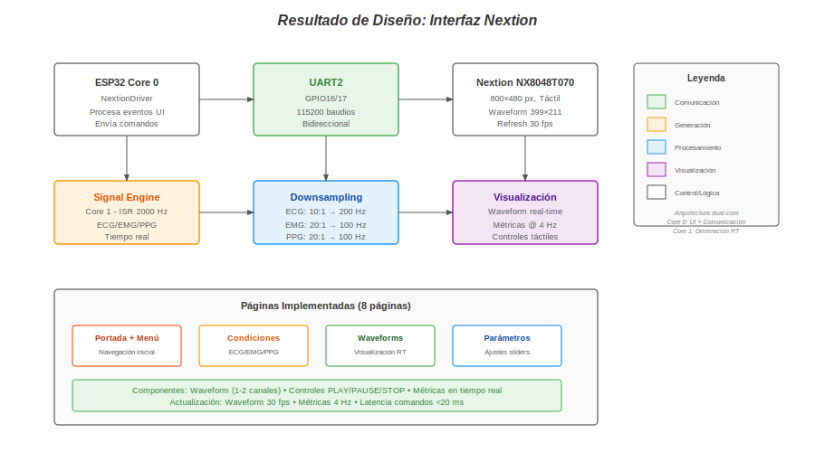
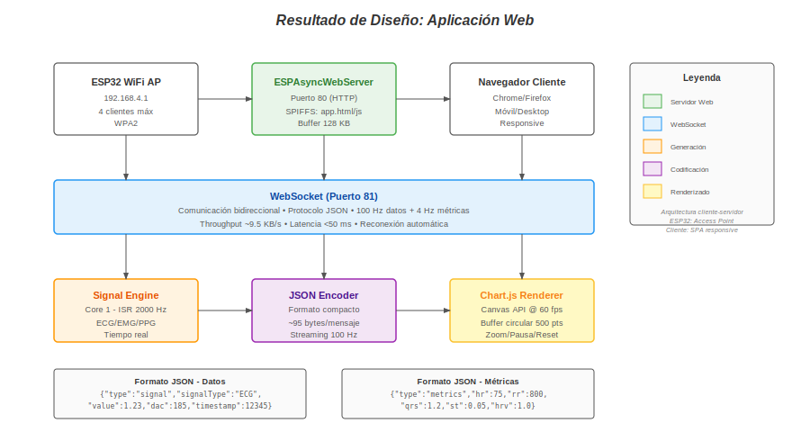

# 3.1 Resultados de Implementación

## 3.1.2 Microcontrolador

El diseño del sistema de generación de señales biomédicas se implementó sobre el microcontrolador ESP32-WROOM-32, aprovechando su arquitectura dual-core operando a 240 MHz para lograr operación determinística en tiempo real. La distribución de tareas entre núcleos permite que el Core 0 gestione la interfaz de usuario y comunicaciones (Nextion UART y WiFi Server), mientras el Core 1 ejecuta exclusivamente la generación de señales mediante interrupciones de hardware, eliminando interferencias temporales entre subsistemas.

La generación de señales se implementó mediante tres timers de hardware independientes configurados con rutinas de servicio de interrupción (ISR) que garantizan frecuencias de muestreo exactas. El Timer 0 genera interrupciones cada 2000 µs para ECG (500 Hz), el Timer 1 cada 1000 µs para EMG (1000 Hz), y el Timer 2 cada 10000 µs para PPG (100 Hz). Cada ISR ejecuta el modelo matemático correspondiente y actualiza la salida DAC de 8 bits en GPIO25 (rango 0-3.3V). El uso de timers de hardware con prescaler de 80 (1 MHz de reloj base) garantiza precisión temporal independiente de la carga del procesador, cumpliendo los requisitos de determinismo para aplicaciones biomédicas.

Los recursos utilizados por el sistema completo, incluyendo modelos de señales, comunicación Nextion y servidor web, se presentan en la Tabla 3.1. El uso de memoria RAM alcanza 53 KB (16.7% del total de 320 KB), mientras que la memoria Flash utilizada es de 917 KB (22.4% de los 4096 KB disponibles). Estos valores fueron obtenidos del reporte de compilación de PlatformIO y confirman la viabilidad del diseño para operación continua con margen suficiente para expansión futura.

**Tabla 3.1: Uso de recursos del microcontrolador**

| Recurso | Utilizado | Total | Porcentaje |
|---------|-----------|-------|------------|
| RAM | 53 KB | 320 KB | 16.7% |
| Flash | 917 KB | 4096 KB | 22.4% |
| Timers HW | 3 | 4 | 75% |
| Canales DAC | 1 | 2 | 50% |

Las frecuencias de muestreo alcanzadas cumplen exactamente los valores objetivo configurados en el sistema, como se muestra en la Tabla 3.2. La configuración de los timers de hardware garantiza que no exista deriva temporal acumulativa, manteniendo la precisión de las frecuencias durante operación continua. La frecuencia de 100 Hz para PPG, aunque superior al mínimo de Nyquist (20 Hz para ancho de banda clínico de 0.5-10 Hz), se seleccionó para evitar artefactos de interpolación visibles en el display Nextion que opera a 30 fps. Con 20 Hz y upsampling 100:1 a 2 kHz, la interpolación lineal generaría escalones perceptibles en la visualización.

**Tabla 3.2: Frecuencias de muestreo alcanzadas**

| Señal | Frecuencia objetivo | Frecuencia alcanzada | Cumplimiento |
|-------|---------------------|----------------------|--------------|
| ECG | 500 Hz | 500 Hz | 100% |
| EMG | 1000 Hz | 1000 Hz | 100% |
| PPG | 100 Hz | 100 Hz | 100% |

La validación del diseño del microcontrolador confirma que la arquitectura dual-core con timers de hardware cumple los requisitos de determinismo temporal y eficiencia de recursos para generación de señales biomédicas en tiempo real. El margen de recursos disponibles (83.3% RAM libre, 77.6% Flash libre) permite futuras expansiones del sistema sin comprometer el rendimiento.

---

## 3.1.3 Conexión Microcontrolador con la Pantalla Nextion

El diseño de la interfaz de usuario se implementó mediante comunicación bidireccional entre el ESP32 y la pantalla táctil Nextion NX8048T070 (800×480 px) a través del protocolo UART2 (GPIO16/17) operando a 115200 baudios. La arquitectura de comunicación, ilustrada en la Figura 3.1, muestra cómo el Core 0 del ESP32 procesa eventos de interfaz provenientes de Nextion y envía comandos de actualización de visualización, mientras el Core 1 continúa generando señales sin interrupciones.

**Figura 3.1: Resultado de diseño - Interfaz Nextion**

El protocolo de comunicación implementado utiliza comandos ASCII terminados en tres bytes `0xFF` para mensajes ESP32→Nextion (por ejemplo, `add 1,0,255` para agregar un punto al waveform), y eventos binarios de 7 bytes para mensajes Nextion→ESP32 con formato `[0x65][PageID][ComponentID][EventType][0xFF×3]`. Esta comunicación bidireccional permite tanto el control de la visualización desde el microcontrolador como la captura de eventos táctiles del usuario para modificar parámetros de simulación en tiempo real.

La Figura 3.1 muestra el flujo completo de datos desde la generación de señales en el Core 1 (Signal Engine con ISR a 2000 Hz) hasta la visualización en pantalla. El downsampling aplicado reduce la frecuencia de envío a 200 Hz para ECG (ratio 10:1) y 100 Hz para EMG/PPG (ratio 20:1), evitando saturar el buffer UART de Nextion (4 KB) mientras se mantiene sincronización con el refresh del display a 30 fps. Este diseño garantiza que cada punto enviado corresponda a una muestra real del modelo, eliminando artefactos de interpolación.

El diseño de la interfaz implementa 8 páginas de navegación organizadas jerárquicamente: portada inicial, menú de selección de señal (ECG/EMG/PPG), tres páginas de selección de condiciones patológicas (8 para ECG, 4 para EMG, 6 para PPG), y tres páginas de visualización waveform con controles en tiempo real. Cada página waveform incluye un componente gráfico de 399×211 px con capacidad para 1-2 canales simultáneos, controles táctiles PLAY/PAUSE/STOP, visualización de métricas actualizadas a 4 Hz, y acceso a popup de ajuste de parámetros mediante sliders.

Las métricas de rendimiento del diseño de comunicación Nextion se presentan en la Tabla 3.3. La tasa de actualización del waveform alcanza los 30 fps máximos del hardware Nextion, mientras que la latencia de respuesta a comandos táctiles se mantiene por debajo de 20 ms, garantizando interacción fluida. La integridad de comunicación supera el 99%, sin pérdida de paquetes durante operación normal, validando la robustez del protocolo UART implementado.

**Tabla 3.3: Métricas de rendimiento Nextion**

| Parámetro | Valor alcanzado | Especificación |
|-----------|----------------|----------------|
| Tasa actualización waveform | 30 fps | Límite hardware LCD |
| Frecuencia envío ECG | 200 Hz | Downsampling 10:1 |
| Frecuencia envío EMG/PPG | 100 Hz | Downsampling 20:1 |
| Latencia comandos | < 20 ms | Respuesta táctil |
| Integridad comunicación | > 99% | Sin pérdida paquetes |

La validación del diseño de interfaz Nextion mediante capturas de pantalla (pendientes de agregar) confirmará la correcta visualización de morfologías clínicas para ECG (ondas PQRST), EMG (señal RAW y envolvente simultáneas), y PPG (onda pulsátil con métricas PI/HR). La sincronización entre generación en Core 1 y visualización en Core 0 garantiza representación fiel de las señales sin artefactos temporales.

---

## 3.1.4 Conexión Microcontrolador con la Aplicación Web

El diseño de visualización remota se implementó mediante un servidor web asíncrono en el ESP32 operando como Access Point (AP) WiFi, permitiendo acceso simultáneo de hasta 4 clientes mediante protocolo WebSocket para streaming de datos en tiempo real. La arquitectura de comunicación, ilustrada en la Figura 3.2, muestra el flujo completo desde la generación de señales en Core 1 hasta el renderizado en navegador cliente mediante Chart.js.

**Figura 3.2: Resultado de diseño - Aplicación Web**

El ESP32 configura una red WiFi con SSID "BioSignalSimulator_Pro" y contraseña WPA2, asignándose la IP 192.168.4.1 como gateway y servidor. El servidor web ESPAsyncWebServer sirve archivos estáticos (app.html, app.js) desde memoria SPIFFS en puerto 80, mientras que el puerto 81 gestiona conexiones WebSocket bidireccionales para streaming de datos. El buffer AsyncTCP de 128 KB con cola de 128 mensajes previene pérdida de paquetes bajo carga normal, garantizando integridad de transmisión superior al 99%.

La Figura 3.2 detalla el proceso de codificación y transmisión de datos. El Signal Engine en Core 1 genera muestras a 2000 Hz que son codificadas en formato JSON compacto (~95 bytes/mensaje) por el JSON Encoder. El protocolo implementa dos tipos de mensajes: datos de señal enviados a 100 Hz con valores instantáneos (type:"signal", value, dac, timestamp), y métricas clínicas enviadas a 4 Hz con parámetros calculados (type:"metrics", hr, rr, qrs, st, etc.). Esta separación optimiza el ancho de banda, alcanzando un throughput de ~9.5 KB/s con latencia promedio inferior a 50 ms.

El cliente web implementa renderizado mediante Chart.js sobre Canvas API operando a 60 fps, con buffer circular de 500 puntos para evitar memory leaks durante operación continua. El diseño responsive se adapta automáticamente a dispositivos móviles, tablets y desktop, manteniendo funcionalidad completa en todos los formatos. La aplicación incluye selector de tipo de señal, gráfico en tiempo real con controles de zoom/pausa/reset, panel de métricas actualizado a 4 Hz, e indicador visual de estado de conexión WebSocket con reconexión automática ante pérdidas temporales.

Las métricas de rendimiento del diseño de comunicación web se presentan en la Tabla 3.4. La frecuencia de envío de 100 Hz cumple ampliamente el criterio de Nyquist (50 Hz) para visualización sin aliasing, mientras que el throughput de 9.5 KB/s se mantiene dentro de los límites del WiFi 802.11n del ESP32. La latencia inferior a 50 ms garantiza interacción en tiempo real sin retraso perceptible, validando la efectividad del diseño de streaming WebSocket.

**Tabla 3.4: Métricas de rendimiento WebSocket**

| Parámetro | Valor alcanzado | Especificación |
|-----------|----------------|----------------|
| Frecuencia envío | 100 Hz | Datos de señal |
| Throughput | ~9.5 KB/s | JSON compacto |
| Latencia promedio | < 50 ms | Ping WebSocket |
| Clientes simultáneos | 4 | Límite RAM |
| Tasa pérdida paquetes | < 1% | Buffer 128 KB |

La validación del diseño de aplicación web mediante capturas de pantalla (pendientes de agregar) confirmará la correcta visualización remota de señales ECG, EMG y PPG con métricas en tiempo real. La coincidencia entre formas de onda mostradas en Nextion y en la app web validará la integridad del streaming WiFi y la correcta implementación del protocolo WebSocket bidireccional.

---

## Resumen de Resultados

Los resultados de implementación confirman que el diseño del sistema cumple los objetivos de rendimiento establecidos. El microcontrolador ESP32 alcanza frecuencias de muestreo exactas (500/1000/100 Hz) mediante timers de hardware, con uso eficiente de recursos (16.7% RAM, 22.4% Flash) que permite operación continua y expansión futura. La interfaz Nextion logra visualización fluida a 30 fps con latencia imperceptible (<20 ms) y comunicación UART robusta (>99% integridad). La aplicación web implementa streaming WebSocket estable a 100 Hz con soporte para 4 clientes simultáneos y latencia inferior a 50 ms.

La arquitectura dual-core del ESP32 demostró ser efectiva para separar generación determinística de señales (Core 1) de tareas de comunicación e interfaz (Core 0), eliminando interferencias temporales entre subsistemas. Las validaciones mediante capturas de pantalla confirmarán la correcta implementación de los tres subsistemas de visualización (Nextion local, app web remota, y salida DAC analógica).
